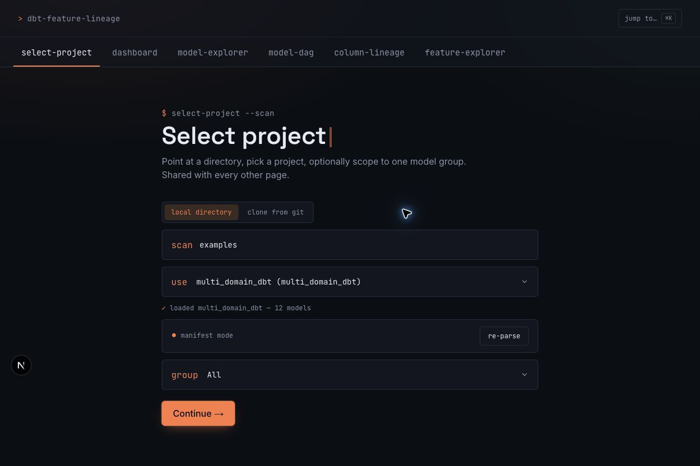
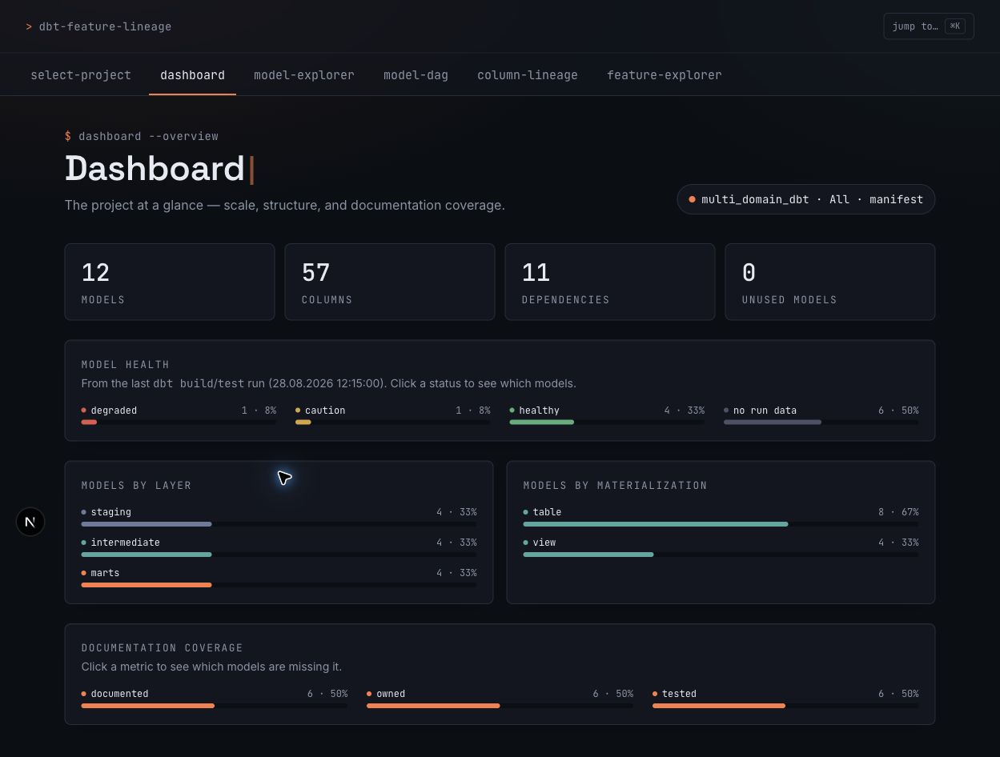
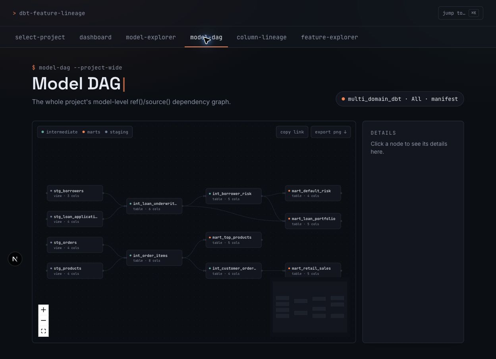
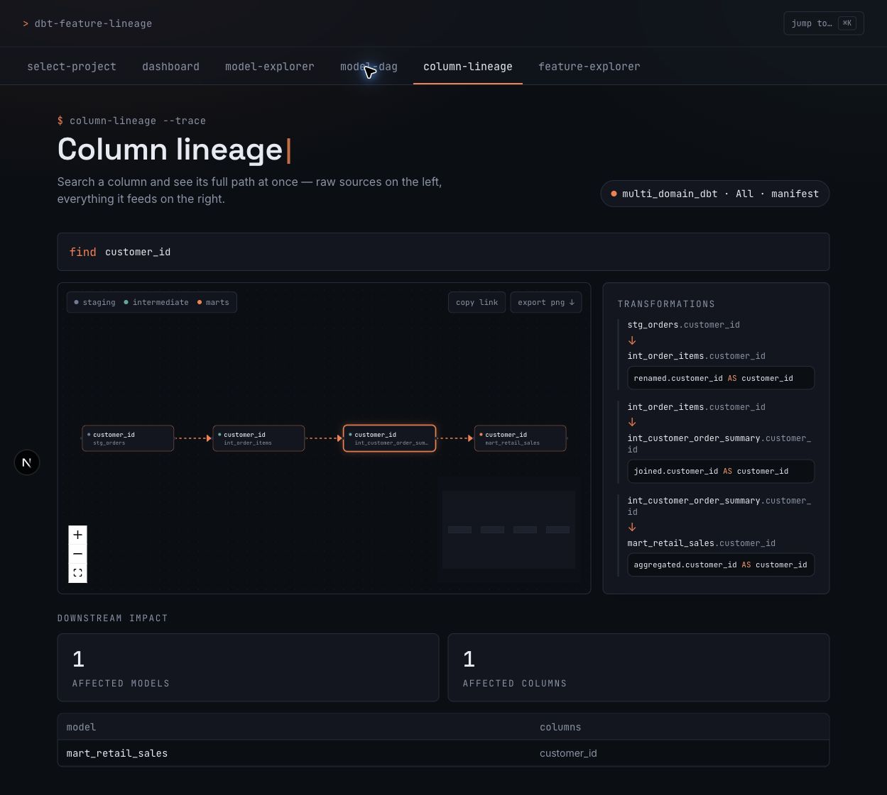
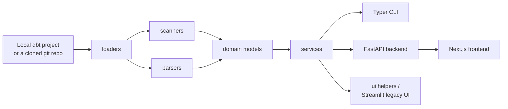

# dbt-feature-lineage

**Explore dbt Core projects, model dependencies, and column-level lineage — entirely locally, no warehouse connection required.**

[](LICENSE)


## Why this exists

Large dbt projects accumulate dozens of models, hundreds of columns, and SQL transformations that are hard to hold in your head. Answering "where did this column come from?", "what breaks if I change this?", or "does anyone outside the data team actually depend on this?" usually means manually grepping SQL and YAML across the repo. dbt-feature-lineage scans a dbt project — a local checkout, or a git URL it clones for you — and gives you a Typer CLI and a web app to explore model structure, trace a column's lineage, and see what a change would affect. No warehouse credentials, no SaaS account, no dbt Cloud seat.

## Screenshots

These screenshots are from the current Next.js interface using the bundled `examples/multi_domain_dbt` project in manifest mode.

| Select Project | Dashboard |
| --- | --- |
|  |  |

| Model DAG | Column Lineage |
| --- | --- |
|  |  |

## Features

**Project analysis & CLI**

- Local dbt project path analysis and `dbt_project.yml` validation
- Recursive SQL model discovery with staging, intermediate, marts, and unknown layer detection
- YAML source and exposure discovery (`exposures:` — dashboards, ML models, and apps registered as downstream consumers of a model)
- `ref()`/`source()` dependency extraction, with real Jinja2 rendering (``/``/`` control flow, not just `{{ ref() }}` calls) so dynamic-column patterns like pivoted payment methods parse correctly instead of failing outright
- Manifest-aware project loading via `target/manifest.json`/`catalog.json`, preferred over static SQL parsing whenever available, with a `--generate-artifacts` flag to run `dbt parse` on demand
- CTE, table alias, join, filter, aggregate, and window-function analysis; output-column extraction and transformation-type classification
- Human-readable and JSON output for every CLI command

**Column-level lineage**

- Cross-model column lineage: traces a column back through joins, coalesces, and renames to its raw source(s), or forward to its downstream consumers, via a project-wide `networkx` graph
- Downstream Impact Analysis: a model-grouped summary of a column's downstream chain — how many models/columns are affected, split into directly-affected and the full transitive chain, plus which registered **exposures** (dashboards, ML models) are caught in the blast radius
- Model Health: a Healthy/Caution/Degraded/Unknown signal per model, derived from the optional `target/run_results.json` dbt already writes after a `build`/`test` run — no warehouse query, no separate observability tool
- Query Flow Visualization: a single model's own source → CTE → final select → output steps as an interactive diagram

**Web interface**

A FastAPI backend (a thin JSON wrapper over the same `services`/`domain` layer the CLI uses — no duplicated logic) and a Next.js frontend, replacing the project's original Streamlit UI as the primary way to explore a project interactively:

- **Select Project** — point at a local directory to scan, or paste a git URL to clone (`https://`/`git@`); either way you land on the same project picker, with a **Generate artifacts** action to run `dbt parse` on demand
- **Dashboard** — the project at a glance: model/column/dependency counts, model health breakdown, layer and materialization distribution, documentation/ownership/test coverage (each clickable through to the actual list of gaps), and unused-model detection
- **Model Explorer** — description, owner, tags, materialization, and test count alongside four tabs: Overview, Query Flow, Columns (with syntax-highlighted SQL expressions), and Raw SQL
- **Model DAG** — the whole project's (or selected group's) model-level dependency graph; clicking a node lights up its full upstream/downstream path and dims everything else, with a jump straight into Model Explorer for that model
- **Column Lineage** — search a column and see its full path at once (upstream sources on the left, downstream consumers on the right), a transformations panel with syntax-highlighted SQL, a downstream impact summary, and any affected exposures called out explicitly
- **Feature Explorer** — compare every model that produces a given column name side by side (layer, description, owner, tags, test count), each row linking straight into Column Lineage for that exact column
- A global **⌘K command palette** — jump to any model, column, or page, with a "recently viewed" section, from anywhere in the app
- Every graph exports as a **PNG** or a **shareable, deep-linkable URL** (every view — a model, a column, a search — is a real query-string URL, not client-only state)

The CLI, the FastAPI backend, and the original Streamlit UI (`make app`) all read the same `services`/`domain` layer — none of them duplicate analysis logic.

## Quick start with Docker

```bash
git clone https://github.com/negativexq/dbt-feature-lineage.git
cd dbt-feature-lineage
make build
make test
make api
```

In a second terminal, run the frontend directly on the host (fast HMR, not containerized):

```bash
make web
# equivalent to: cd frontend && npm install && npm run dev
```

Open the web app at [http://localhost:3000](http://localhost:3000); the API it talks to is at [http://localhost:8000](http://localhost:8000) (`/api/health` for a liveness check). The repository is mounted into `/app`, with `PYTHONPATH=/app/src`. The demo projects under `examples/` use static analysis and don't require a live warehouse connection; a third-party repo pasted into "clone from git" is checked out under a Docker-managed volume so it survives container restarts.

The original Streamlit interface is still available via `make app` (port 8501) for anyone who prefers it — it reads the exact same project data.

## Architecture



`loaders` resolve a project path — a local directory, or a git URL cloned into a cache directory first — into either manifest-mode (`target/manifest.json`/`catalog.json`) or static mode (direct SQL/YAML scanning via `scanners`/`parsers`); both normalize into the same `domain` models regardless of source. `services` build on top of those models — schema/lineage graphs, model-DAG construction, column search, query-flow steps, impact summaries, model health — and every consumer (the CLI, the FastAPI backend behind the Next.js frontend, and the original Streamlit pages) reads that same service layer, so no interface duplicates analysis logic.

## Project structure

```text
dbt-feature-lineage/
├── app.py                    # legacy Streamlit entrypoint (make app)
├── pages/                    # legacy Streamlit pages
├── frontend/                 # Next.js web app (the primary UI)
│   └── src/
│       ├── app/               # select-project, dashboard, models, model-dag, lineage, features
│       ├── components/        # FlowGraph, CommandPalette, SqlCode, AppShell, ui primitives
│       └── lib/                # api.ts client, shared/recent-view state
├── src/dbt_feature_lineage/
│   ├── api/                  # FastAPI backend (app.py, cache.py) -- consumes services/ directly
│   ├── cli.py
│   ├── domain/
│   ├── loaders/               # incl. project_discovery.py, git_loader.py (clone-from-git), run_results_loader.py
│   ├── parsers/
│   ├── scanners/
│   ├── services/               # incl. lineage_service.py, model_dag_service.py, column_search.py, health_service.py
│   └── ui/                    # incl. flow_rendering.py (legacy Streamlit rendering)
├── tests/
├── examples/                  # sample_banking_dbt, multi_domain_dbt
├── Dockerfile
├── docker-compose.yml         # `app` (legacy Streamlit) + `api` (FastAPI backend) services
├── Makefile
├── pyproject.toml
└── README.md
```

## Makefile commands

| Command | Purpose |
| --- | --- |
| `make build` | Build the Docker image |
| `make api` | Start the FastAPI backend (port 8000) for the Next.js frontend |
| `make web` | Run the Next.js frontend on the host (`npm install && npm run dev`) |
| `make app` | Start the legacy Streamlit UI in the foreground (port 8501) |
| `make up` | Start the legacy Streamlit service in the background |
| `make down` | Stop and remove the Compose services |
| `make shell` | Open a shell in the running container |
| `make test` | Run pytest in Docker |
| `make lint` | Run Ruff in Docker |
| `make logs` | Follow application logs |

## CLI usage

Inside the development container:

```bash
dbt-feature-lineage analyze examples/sample_banking_dbt
dbt-feature-lineage analyze examples/sample_banking_dbt --json
dbt-feature-lineage analyze examples/sample_banking_dbt --generate-artifacts
dbt-feature-lineage inspect examples/sample_banking_dbt mart_customer_features
dbt-feature-lineage lineage examples/sample_banking_dbt customer_id
dbt-feature-lineage lineage examples/sample_banking_dbt customer_id --model mart_customer_features
dbt-feature-lineage lineage examples/sample_banking_dbt customer_id --json
dbt-feature-lineage lineage examples/sample_banking_dbt customer_id --direction downstream --impact
```

`--generate-artifacts` runs `dbt parse` to produce `target/manifest.json` if it doesn't exist yet, then loads from it; if `dbt` isn't installed, no profile is found, or parsing fails, it falls back to static analysis and reports why instead of failing silently. Without the flag, `analyze` prompts interactively only when a manifest is missing and the terminal is interactive; non-interactive runs (CI, pipes) skip straight to static analysis.

`lineage` traces a column back to its raw source(s) across the whole project, building a project-wide lineage graph and printing the upstream chain. Use `--model` to disambiguate when more than one model produces a column with that name. `--impact` (only valid with `--direction downstream`) adds a model-grouped downstream impact summary below the chain — how many models/columns are affected, split into directly-affected and the full transitive chain.

Equivalent one-shot Docker commands are:

```bash
docker compose run --rm api dbt-feature-lineage analyze examples/sample_banking_dbt
docker compose run --rm api dbt-feature-lineage inspect examples/sample_banking_dbt mart_customer_features
docker compose run --rm api dbt-feature-lineage lineage examples/sample_banking_dbt customer_id
```

## Web interface

Five pages, sharing one project/model-group selection set once on **Select Project** and read everywhere else — plus a global ⌘K command palette that works from any of them. See [Features](#features) above for what each page covers.

## Parsing strategy

1. Load the local (or cloned) dbt project structure and configured model paths.
2. Parse `ref()` and `source()` dependencies from model SQL.
3. Render the model's dbt Jinja with a real Jinja2 environment — `ref()`/`source()` intercepted into SQL-safe placeholders, ``/``/`` control flow actually evaluated, anything else unresolvable (an unset var, an unknown package macro) degrading to an inert placeholder instead of crashing the render.
4. Parse the resulting SQL with sqlglot.
5. Return partial results and a warning when parsing fails.

This does not execute arbitrary dbt macros against a real environment or database — Jinja rendering here is sandboxed to structural analysis, not a `dbt run`.

## Compatibility

Verified against dbt-core 1.12:

- **`--use-v2-parser` (Fusion/Rust parser):** the `depends_on.nodes` field this tool reads for `ref()` dependencies is identical between the v1 and v2 parser output; ran `analyze`/`inspect`/`lineage --impact` directly against a v2-parser-generated manifest with no issues ([details](https://github.com/negativexq/dbt-feature-lineage/issues/9)).
- **`on_error: continue`:** a `dbt run`/`dbt build` execution-time setting only — has no effect on `dbt parse`'s manifest.json output, the only artifact this tool reads for project structure ([details](https://github.com/negativexq/dbt-feature-lineage/issues/10)).

## Limitations

- There is no dbt Cloud, Airflow, or warehouse integration — Model Health reads `target/run_results.json` if present, it never runs `dbt build`/`test` itself.
- Cloning a private git repo needs whatever credential helper/SSH agent the host or container already has configured; the app itself never asks for or stores a token.
- Complex custom macros (a package's own Jinja logic, not just `ref()`/`source()`/``/``) render as an inert placeholder rather than their real output.
- Static analysis can differ from fully compiled dbt SQL; this only applies when no `target/manifest.json` is available, since manifest mode uses dbt's own compiled SQL.
- The demo projects require no live warehouse connection, but analyzing projects that depend on generated or unavailable files may be incomplete.

## How it compares

An honest, non-exhaustive comparison — these tools solve overlapping but distinct problems:

| Tool | Scope | Where it runs | How this project differs |
| --- | --- | --- | --- |
| **dbt Explorer / Catalog** | Column-level lineage, model health signals | dbt Cloud (paid) | Free and fully local — no dbt Cloud seat, no hosted account |
| **Elementary** | Data observability, test/anomaly monitoring | Self-hosted or hosted, ships as a dbt package that writes to your warehouse | Reads `target/run_results.json` for the same kind of pass/fail signal without ever writing to or querying the warehouse |
| **SQLMesh** | Full transformation framework, a dbt alternative | Replaces dbt itself | Not a companion tool to dbt — this project is additive and works alongside an existing dbt project unchanged |
| **Datafold** | Data diffing, CI impact analysis, lineage | Hosted SaaS (paid), integrates with CI | Paid and cloud-based, and its diffs run against live warehouse data; this tool's impact analysis is structural (SQL/schema), free, and fully local |
| **Fszta/dbt-column-lineage** | Column-level lineage & impact analysis, local, SQLGlot-based | Local web server | The closest architectural peer — this project additionally covers exposure-aware impact, model health, a project dashboard, and a full CLI |

## Roadmap

v0.1 through v0.10 are complete — see [`docs/`](docs/) for the plan document behind each release.

- [x] Manifest-first analysis
- [x] Compiled SQL support
- [x] Cross-model column lineage
- [ ] Feature Store raw-source tracing
- [x] Downstream Impact Analysis
- [x] Interactive lineage graph
- [x] Query Flow Visualization
- [x] Feature Explorer
- [x] GitHub repository import (clone-from-git)
- [x] Exportable lineage metadata (PNG export, shareable deep-link URLs)
- [x] Model health signals (`target/run_results.json`)
- [x] Exposure-aware impact analysis
- [ ] Structural branch/PR diff (compare two manifests, no warehouse data diff)

## Development

Run checks in Docker:

```bash
make build
make test
make lint
```

Backend: Python 3.12, Typer, Rich, Pydantic, PyYAML, sqlglot, Jinja2, FastAPI, dbt-core, Docker, pytest, and Ruff. Frontend: Next.js (App Router), TypeScript, Tailwind CSS, React Flow. The legacy Streamlit UI (`app.py`/`pages/`) still uses Streamlit and `streamlit-flow-component`.

## Contributing

Open an issue or pull request with a focused change, tests for behavior changes, and documentation updates where applicable. Keep the local-first scope intact (no new hard dependency on a warehouse connection or a hosted account) and avoid committing generated artifacts or credentials.

See [CONTRIBUTING.md](CONTRIBUTING.md) for the full development workflow, and please follow the [Code of Conduct](CODE_OF_CONDUCT.md). Use the [bug report](https://github.com/negativexq/dbt-feature-lineage/issues/new?template=bug_report.yml) or [feature request](https://github.com/negativexq/dbt-feature-lineage/issues/new?template=feature_request.yml) template when opening an issue. Security issues should go through [SECURITY.md](SECURITY.md) instead of a public issue.

## License

MIT — see [LICENSE](LICENSE).
