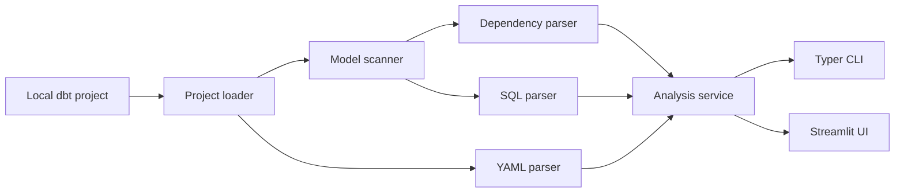

# dbt-feature-lineage

**A developer-first local explorer for dbt Core projects.**

**Status:** MVP · **Python:** 3.12 · **Runtime:** Docker · **License:** not yet defined

## Overview

Large dbt projects can contain many models, CTEs, joins, transformations, and feature columns. Understanding how a model is constructed often requires manually navigating SQL and YAML files. dbt-feature-lineage scans a local dbt project and provides a developer-focused interface for exploring model discovery, dbt dependencies, and SQL structure through a Typer CLI and a local Streamlit application.

## Current features

- Local dbt project path analysis and `dbt_project.yml` validation
- Recursive SQL model discovery with staging, intermediate, marts, and unknown layer detection
- YAML source discovery and source-table parsing
- `ref()` and `source()` dependency extraction
- Human-readable project summaries and JSON CLI output
- Individual model inspection with graceful parser fallback
- Jinja preprocessing for `ref()` and `source()` calls
- CTE, table alias, join, filter, aggregate, and window-function analysis
- Output-column extraction and transformation-type classification
- Streamlit model explorer with model search and layer filtering
- Overview, Query Flow, Columns, and Raw SQL tabs

Full cross-model column-level lineage is not implemented yet.

## Demo project

The repository includes [`examples/sample_banking_dbt`](examples/sample_banking_dbt), a realistic banking analytics and Feature Store pipeline with staging, intermediate, marts, and feature store export layers. Its main complex model is `mart_customer_features`.

```text
Raw banking sources
        ↓
Staging models
        ↓
Intermediate customer metrics
        ↓
mart_customer_features
        ↓
mart_feature_store_export
```

## Architecture



## Project structure

```text
dbt-feature-lineage/
├── app.py
├── src/dbt_feature_lineage/
│   ├── cli.py
│   ├── domain/
│   ├── loaders/
│   ├── parsers/
│   ├── scanners/
│   ├── services/
│   └── ui/
├── tests/
├── examples/sample_banking_dbt/
├── Dockerfile
├── docker-compose.yml
├── Makefile
├── pyproject.toml
└── README.md
```

## Quick start with Docker

```bash
git clone https://github.com/negativexq/dbt-feature-lineage.git
cd dbt-feature-lineage
make build
make test
make app
```

Open the application at [http://localhost:8501](http://localhost:8501). The repository is mounted into `/app`, with `PYTHONPATH=/app/src`; Streamlit polling is enabled for Docker development. The demo project uses static analysis and does not require a live warehouse connection.

## Makefile commands

| Command | Purpose |
| --- | --- |
| `make build` | Build the Docker image |
| `make up` | Start the app in the background |
| `make app` | Start Streamlit in the foreground |
| `make down` | Stop and remove the Compose services |
| `make shell` | Open a shell in the running container |
| `make test` | Run pytest in Docker |
| `make lint` | Run Ruff in Docker |
| `make logs` | Follow application logs |

## CLI usage

Inside the development container:

```bash
dbt-feature-lineage analyze examples/sample_banking_dbt
dbt-feature-lineage analyze examples/sample_banking_dbt --json
dbt-feature-lineage inspect examples/sample_banking_dbt mart_customer_features
```

Equivalent one-shot Docker commands are:

```bash
docker compose run --rm app dbt-feature-lineage analyze examples/sample_banking_dbt
docker compose run --rm app dbt-feature-lineage inspect examples/sample_banking_dbt mart_customer_features
```

## Web interface

The Streamlit application defaults to `examples/sample_banking_dbt`. Use the sidebar to search, filter, and select models.

- **Overview:** model path, layer, upstream models, source dependencies, and summary counts
- **Query Flow:** sources, upstream models, CTEs, joins, filters, aggregations, and final output
- **Columns:** output expressions, transformation types, referenced input columns, and selected-column details
- **Raw SQL:** original SQL and the preprocessed SQL sent to sqlglot

<!-- Add screenshot: docs/images/model-overview.png -->

## Parsing strategy

1. Load the local dbt project structure and configured model paths.
2. Parse `ref()` and `source()` dependencies from model SQL.
3. Replace dbt Jinja relations with SQL-safe placeholders.
4. Parse the resulting SQL with sqlglot.
5. Return partial results and a warning when parsing fails.

The MVP does not execute arbitrary dbt macros.

## Limitations

- Full cross-model column lineage is not implemented.
- There is no dbt Cloud, Airflow, or warehouse integration.
- The UI does not clone Git repositories.
- Complex custom macros may not parse correctly.
- Static analysis can differ from fully compiled dbt SQL.
- The demo project requires no live warehouse connection, but analyzing projects that depend on generated or unavailable files may be incomplete.

## Roadmap

- [ ] Manifest-first analysis
- [ ] Compiled SQL support
- [ ] Cross-model column lineage
- [ ] Feature Store raw-source tracing
- [ ] Impact analysis
- [ ] Interactive lineage graph
- [ ] GitHub repository import
- [ ] Exportable lineage metadata

## Development

Run checks in Docker:

```bash
make build
make test
make lint
```

The project uses Python 3.12, Typer, Rich, Pydantic, PyYAML, sqlglot, Streamlit, Docker, pytest, and Ruff.

## Contributing

Open an issue or pull request with a focused change, tests for behavior changes, and documentation updates where applicable. Keep the local static-analysis scope intact and avoid committing generated artifacts or credentials.
