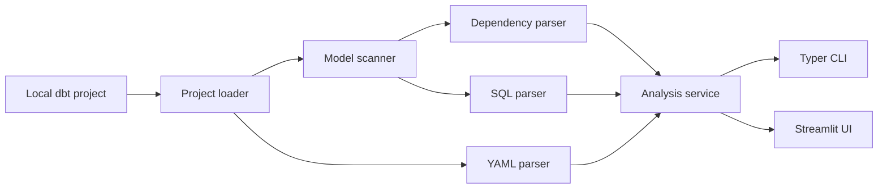

# dbt-feature-lineage

**Open-source developer tool for exploring dbt Core projects, model dependencies, SQL structure, and lineage.**

**Status:** MVP · **Python:** 3.12 · **Runtime:** Docker · **License:** not yet defined

## Overview

Large dbt projects can contain many models, CTEs, joins, transformations, and feature columns. Understanding how a model is constructed often requires manually navigating SQL and YAML files. dbt-feature-lineage scans a local dbt project and provides a developer-focused interface for exploring model discovery, dbt dependencies, and SQL structure through a Typer CLI and a local Streamlit application.

## Current features

- Local dbt project path analysis and `dbt_project.yml` validation
- Recursive SQL model discovery with staging, intermediate, marts, and unknown layer detection
- YAML source discovery and source-table parsing
- `ref()` and `source()` dependency extraction
- Human-readable project summaries and JSON CLI output
- Individual model inspection with graceful parser fallback
- Manifest-aware project loading via `target/manifest.json` and `catalog.json`, preferred over static SQL parsing whenever available
- `--generate-artifacts` CLI flag (and a matching "Generate artifacts" button in the Streamlit UI) to run `dbt parse` on demand, with a reported, non-silent fallback to static analysis if it can't
- Model inspection uses dbt's actual compiled SQL when a manifest is present, instead of re-parsing the raw Jinja source
- Jinja preprocessing for `ref()` and `source()` calls
- CTE, table alias, join, filter, aggregate, and window-function analysis
- Output-column extraction and transformation-type classification
- Streamlit model explorer with model search and layer filtering
- Overview, Query Flow, Columns, and Raw SQL tabs
- Cross-model column-level lineage: traces a column back through joins, coalesces, and renames to its raw source(s) — or forward to its downstream consumers — via a project-wide `networkx` graph
- `lineage` CLI command and a dedicated "Column Lineage" Streamlit page for searching a column by name and viewing its upstream/downstream chain as an interactive graph
- Model DAG: a project-wide model-level dependency graph (materialization, column count per node; owner/tests/description/tags on click) — both this and Column Lineage render via the same `streamlit-flow-component` (React Flow) interactive graph, with zoom/pan/minimap
- Shared "Select Project" page: scans a root directory for dbt projects and lets you pick one project and (optionally) one model group once — Model Explorer, Model DAG, and Column Lineage all read that same shared selection instead of asking for a project path or group individually
- Query Flow Visualization: Model Explorer's Query Flow tab renders a single model's own source → CTE → final select → output steps as the same interactive `streamlit-flow-component` graph used by Model DAG/Column Lineage, with each CTE's own joins/filters/aggregations shown as node badges and a click-to-inspect detail panel
- Feature Explorer: searches a column name across the whole project and lists every model that produces it side by side, comparing each one's own description, owner, tags, and test count — no lineage tracing involved

## Demo project

The repository includes [`examples/sample_banking_dbt`](examples/sample_banking_dbt), a realistic banking analytics and Feature Store pipeline with staging, intermediate, marts, and feature store export layers. Its main complex model is `mart_customer_features`.

The project ships with a `profiles.yml` using entirely placeholder postgres credentials, so `dbt parse` can run end-to-end without a live warehouse connection — this lets you exercise manifest mode (see `--generate-artifacts` below) against the demo project directly.

```text
Raw banking sources
        ↓
Staging models
        ↓
Intermediate customer metrics
        ↓
mart_customer_features
        ↓
mart_feature_store_export
```

## Architecture



## Project structure

```text
dbt-feature-lineage/
├── app.py
├── pages/                    # select_project.py, model_explorer.py, model_dag.py, column_lineage.py, feature_explorer.py
├── src/dbt_feature_lineage/
│   ├── cli.py
│   ├── domain/
│   ├── loaders/              # incl. project_discovery.py (dbt project root scan)
│   ├── parsers/
│   ├── scanners/
│   ├── services/             # incl. lineage_service.py, model_dag_service.py
│   └── ui/                   # incl. flow_rendering.py (streamlit-flow-component)
├── tests/
├── examples/sample_banking_dbt/
├── Dockerfile
├── docker-compose.yml
├── Makefile
├── pyproject.toml
└── README.md
```

## Quick start with Docker

```bash
git clone https://github.com/negativexq/dbt-feature-lineage.git
cd dbt-feature-lineage
make build
make test
make app
```

Open the application at [http://localhost:8501](http://localhost:8501). The repository is mounted into `/app`, with `PYTHONPATH=/app/src`; Streamlit polling is enabled for Docker development. The demo project uses static analysis and does not require a live warehouse connection.

## Makefile commands

| Command | Purpose |
| --- | --- |
| `make build` | Build the Docker image |
| `make up` | Start the app in the background |
| `make app` | Start Streamlit in the foreground |
| `make down` | Stop and remove the Compose services |
| `make shell` | Open a shell in the running container |
| `make test` | Run pytest in Docker |
| `make lint` | Run Ruff in Docker |
| `make logs` | Follow application logs |

## CLI usage

Inside the development container:

```bash
dbt-feature-lineage analyze examples/sample_banking_dbt
dbt-feature-lineage analyze examples/sample_banking_dbt --json
dbt-feature-lineage analyze examples/sample_banking_dbt --generate-artifacts
dbt-feature-lineage inspect examples/sample_banking_dbt mart_customer_features
dbt-feature-lineage lineage examples/sample_banking_dbt customer_id
dbt-feature-lineage lineage examples/sample_banking_dbt customer_id --model mart_customer_features
dbt-feature-lineage lineage examples/sample_banking_dbt customer_id --json
```

`--generate-artifacts` runs `dbt parse` to produce `target/manifest.json` if it doesn't exist yet, then loads from it; if `dbt` isn't installed, no profile is found, or parsing fails, it falls back to static analysis and reports why instead of failing silently. Without the flag, `analyze` prompts interactively only when a manifest is missing and the terminal is interactive; non-interactive runs (CI, pipes) skip straight to static analysis.

`lineage` traces a column back to its raw source(s) across the whole project, building a project-wide lineage graph and printing the upstream chain. Use `--model` to disambiguate when more than one model produces a column with that name.

Equivalent one-shot Docker commands are:

```bash
docker compose run --rm app dbt-feature-lineage analyze examples/sample_banking_dbt
docker compose run --rm app dbt-feature-lineage inspect examples/sample_banking_dbt mart_customer_features
docker compose run --rm app dbt-feature-lineage lineage examples/sample_banking_dbt customer_id
```

## Web interface

The Streamlit application has five pages, selectable from the sidebar navigation, with **Select Project** as the default landing page.

**Select Project** — enter a root directory (defaults to `examples`) to recursively scan for dbt projects (any directory containing a `dbt_project.yml`), pick one from the discovered list, and optionally narrow it down to a single model group (domain). This selection is written once to shared session state; the other four pages read it rather than asking for a project path (or, for Model DAG, Column Lineage, and Feature Explorer, a group filter) individually. Each page shows the currently active project/group in its header with a "Change" link back to Select Project, and prompts you to pick a project first if none has been selected yet.

**Model Explorer** — select a single model and dig into it via four tabs:

- **Overview:** model path, layer, upstream models, source dependencies, and summary counts
- **Query Flow:** an interactive diagram of the model's own source → CTE → final select → output steps (same `streamlit-flow-component` graph as Model DAG/Column Lineage); each step's own joins/filters/aggregations show as node badges, and clicking a step opens a detail panel with its upstream links and output columns
- **Columns:** output expressions, transformation types, referenced input columns, and selected-column details
- **Raw SQL:** original SQL and the preprocessed SQL sent to sqlglot

**Model DAG** — independent of Model Explorer's model selection; the whole project's (or, if a model group was picked on Select Project, that group's) model-level `ref()`/`source()` dependency graph, rendered interactively (zoom/pan/minimap) via `streamlit-flow-component`. Each node shows materialization and column count; clicking a node opens a detail panel with owner, test count, description, and tags (fields left blank when the manifest — or static mode — doesn't have them).

**Column Lineage** — independent of Model Explorer's model selection; searches the project (or the selected model group) by column name and renders the matching column's upstream or downstream chain as the same interactive graph component Model DAG uses, for a consistent visual language between the two. When a model group is selected on Select Project, the lineage trace itself is scoped to that group, not just the search results.

**Feature Explorer** — independent of Model Explorer's model selection and of lineage tracing; searches the project (or the selected model group) by column name and, once you pick a specific column from the matches (exact name match sorted first), lists every model producing it side by side — layer, description, owner, tags, and test count — as a plain table rather than a graph, since the models sharing a column name aren't connected to each other by that fact. Static-mode projects show a warning that description/owner/tags/tests will be empty until a manifest is generated.

<!-- Add screenshot: docs/images/model-overview.png -->

## Parsing strategy

1. Load the local dbt project structure and configured model paths.
2. Parse `ref()` and `source()` dependencies from model SQL.
3. Replace dbt Jinja relations with SQL-safe placeholders.
4. Parse the resulting SQL with sqlglot.
5. Return partial results and a warning when parsing fails.

The MVP does not execute arbitrary dbt macros.

## Limitations

- There is no dbt Cloud, Airflow, or warehouse integration.
- The UI does not clone Git repositories.
- Complex custom macros may not parse correctly.
- Static analysis can differ from fully compiled dbt SQL; this only applies when no `target/manifest.json` is available, since manifest mode uses dbt's own compiled SQL.
- The demo project requires no live warehouse connection, but analyzing projects that depend on generated or unavailable files may be incomplete.

## Roadmap

- [x] Manifest-first analysis
- [x] Compiled SQL support
- [x] Cross-model column lineage
- [ ] Feature Store raw-source tracing
- [ ] Impact analysis
- [x] Interactive lineage graph
- [x] Query Flow Visualization
- [x] Feature Explorer
- [ ] GitHub repository import
- [ ] Exportable lineage metadata

## Development

Run checks in Docker:

```bash
make build
make test
make lint
```

The project uses Python 3.12, Typer, Rich, Pydantic, PyYAML, sqlglot, Streamlit, streamlit-flow-component, Docker, pytest, and Ruff.

## Contributing

Open an issue or pull request with a focused change, tests for behavior changes, and documentation updates where applicable. Keep the local static-analysis scope intact and avoid committing generated artifacts or credentials.
