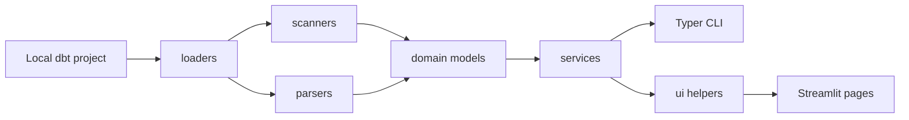
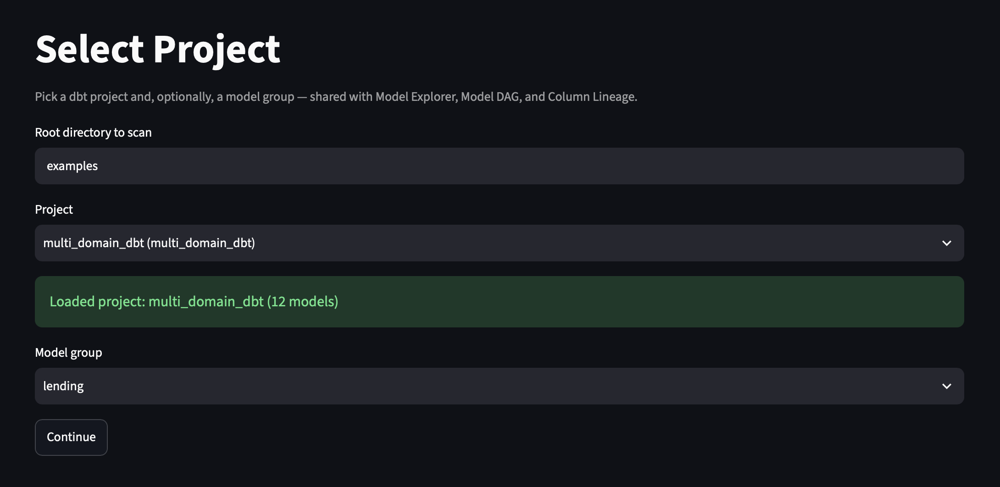
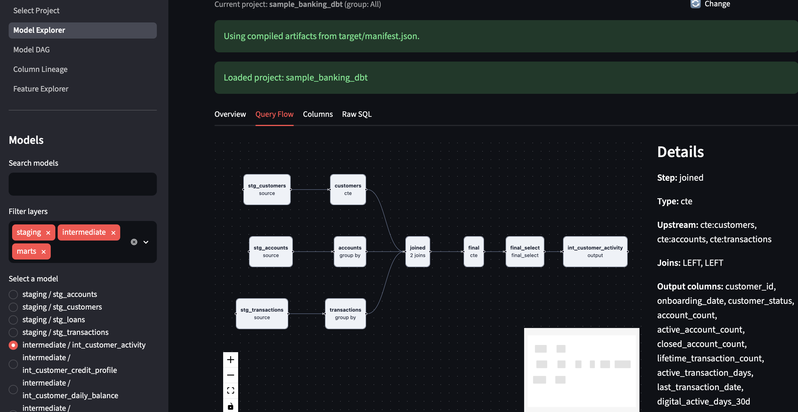
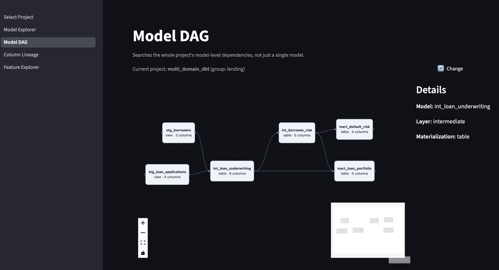
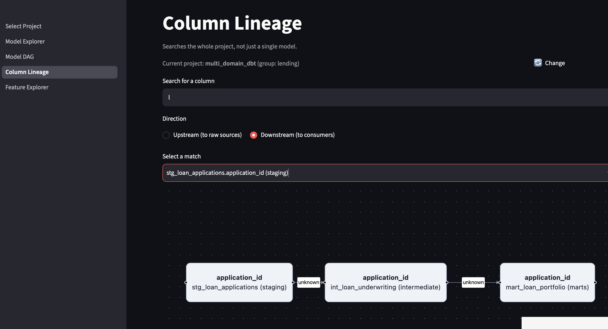
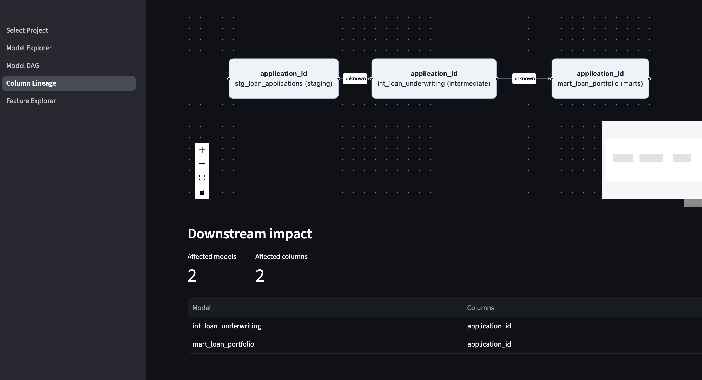
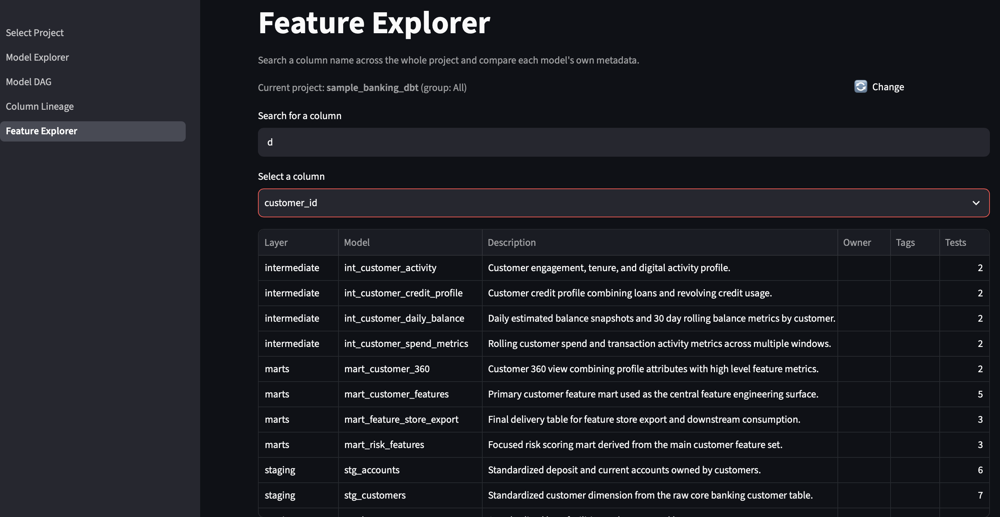

# dbt-feature-lineage

**Explore dbt Core projects, model dependencies, and column-level lineage — entirely locally.**

[](LICENSE)


## Why this exists

Large dbt projects accumulate dozens of models, hundreds of columns, and SQL transformations that are hard to hold in your head. Answering "where did this column come from?" or "what breaks if I change this?" usually means manually grepping SQL and YAML across the repo. dbt-feature-lineage scans a local dbt project — no warehouse connection, no SaaS account — and gives you a Typer CLI and a Streamlit UI to explore model structure, trace a column's lineage, and see what a change would affect.

## Features

**Project analysis & CLI**

- Local dbt project path analysis and `dbt_project.yml` validation
- Recursive SQL model discovery with staging, intermediate, marts, and unknown layer detection
- YAML source discovery and source-table parsing
- `ref()`/`source()` dependency extraction, with Jinja preprocessing
- Manifest-aware project loading via `target/manifest.json`/`catalog.json`, preferred over static SQL parsing whenever available, with a `--generate-artifacts` flag to run `dbt parse` on demand
- CTE, table alias, join, filter, aggregate, and window-function analysis; output-column extraction and transformation-type classification
- Human-readable and JSON output for every CLI command

**Column-level lineage**

- Cross-model column lineage: traces a column back through joins, coalesces, and renames to its raw source(s), or forward to its downstream consumers, via a project-wide `networkx` graph
- Downstream Impact Analysis: a model-grouped summary of a column's downstream chain — how many models/columns are affected, split into directly-affected and the full transitive chain
- Query Flow Visualization: a single model's own source → CTE → final select → output steps as an interactive diagram

**Interactive Streamlit interface**

- Five pages sharing one project/model-group selection: Select Project, Model Explorer, Model DAG, Column Lineage, Feature Explorer
- Model-level and column-level dependency graphs rendered via `streamlit-flow-component` (zoom/pan/minimap/click-to-inspect)
- Feature Explorer: compare every model that produces a given column name side by side (description, owner, tags, test count)

## Quick start with Docker

```bash
git clone https://github.com/negativexq/dbt-feature-lineage.git
cd dbt-feature-lineage
make build
make test
make app
```

Open the application at [http://localhost:8501](http://localhost:8501). The repository is mounted into `/app`, with `PYTHONPATH=/app/src`; Streamlit polling is enabled for Docker development. The demo project uses static analysis and does not require a live warehouse connection.

## Architecture



`loaders` resolve a project path into either manifest-mode (`target/manifest.json`/`catalog.json`) or static mode (direct SQL/YAML scanning via `scanners`/`parsers`); both normalize into the same `domain` models regardless of source. `services` build on top of those models — schema/lineage graphs, model-DAG construction, column search, query-flow steps, impact summaries — and both the CLI and the Streamlit pages (via thin `ui` helpers) consume the same service layer, so the two interfaces never duplicate logic.

## Project structure

```text
dbt-feature-lineage/
├── app.py
├── pages/                    # select_project.py, model_explorer.py, model_dag.py, column_lineage.py, feature_explorer.py
├── src/dbt_feature_lineage/
│   ├── cli.py
│   ├── domain/
│   ├── loaders/              # incl. project_discovery.py (dbt project root scan)
│   ├── parsers/
│   ├── scanners/
│   ├── services/             # incl. lineage_service.py, model_dag_service.py, column_search.py
│   └── ui/                   # incl. flow_rendering.py (streamlit-flow-component)
├── tests/
├── examples/sample_banking_dbt/
├── Dockerfile
├── docker-compose.yml
├── Makefile
├── pyproject.toml
└── README.md
```

## Makefile commands

| Command | Purpose |
| --- | --- |
| `make build` | Build the Docker image |
| `make up` | Start the app in the background |
| `make app` | Start Streamlit in the foreground |
| `make down` | Stop and remove the Compose services |
| `make shell` | Open a shell in the running container |
| `make test` | Run pytest in Docker |
| `make lint` | Run Ruff in Docker |
| `make logs` | Follow application logs |

## CLI usage

Inside the development container:

```bash
dbt-feature-lineage analyze examples/sample_banking_dbt
dbt-feature-lineage analyze examples/sample_banking_dbt --json
dbt-feature-lineage analyze examples/sample_banking_dbt --generate-artifacts
dbt-feature-lineage inspect examples/sample_banking_dbt mart_customer_features
dbt-feature-lineage lineage examples/sample_banking_dbt customer_id
dbt-feature-lineage lineage examples/sample_banking_dbt customer_id --model mart_customer_features
dbt-feature-lineage lineage examples/sample_banking_dbt customer_id --json
dbt-feature-lineage lineage examples/sample_banking_dbt customer_id --direction downstream --impact
```

`--generate-artifacts` runs `dbt parse` to produce `target/manifest.json` if it doesn't exist yet, then loads from it; if `dbt` isn't installed, no profile is found, or parsing fails, it falls back to static analysis and reports why instead of failing silently. Without the flag, `analyze` prompts interactively only when a manifest is missing and the terminal is interactive; non-interactive runs (CI, pipes) skip straight to static analysis.

`lineage` traces a column back to its raw source(s) across the whole project, building a project-wide lineage graph and printing the upstream chain. Use `--model` to disambiguate when more than one model produces a column with that name. `--impact` (only valid with `--direction downstream`) adds a model-grouped downstream impact summary below the chain — how many models/columns are affected, split into directly-affected and the full transitive chain.

Equivalent one-shot Docker commands are:

```bash
docker compose run --rm app dbt-feature-lineage analyze examples/sample_banking_dbt
docker compose run --rm app dbt-feature-lineage inspect examples/sample_banking_dbt mart_customer_features
docker compose run --rm app dbt-feature-lineage lineage examples/sample_banking_dbt customer_id
```

## Web interface

The Streamlit application has five pages, selectable from the sidebar navigation, with **Select Project** as the default landing page. All five share one project/model-group selection, set once and read everywhere else.

**Select Project** — scans a root directory (defaults to `examples`) for dbt projects, lets you pick one and, optionally, a single model group to scope every other page to.



**Model Explorer** — select a single model and dig into it via four tabs: Overview, Query Flow (an interactive source → CTE → final select → output diagram, click a step for its own join/filter/aggregation details), Columns, and Raw SQL.



**Model DAG** — the whole project's (or selected group's) model-level dependency graph, rendered interactively; click a node for materialization, owner, tests, description, and tags.



**Column Lineage** — search a column by name and view its upstream or downstream chain as an interactive graph; for the downstream direction, a **Downstream impact** panel below the graph groups the same chain by model.




**Feature Explorer** — search a column name and compare every model that produces it side by side (layer, description, owner, tags, test count), independent of lineage tracing.



## Parsing strategy

1. Load the local dbt project structure and configured model paths.
2. Parse `ref()` and `source()` dependencies from model SQL.
3. Replace dbt Jinja relations with SQL-safe placeholders.
4. Parse the resulting SQL with sqlglot.
5. Return partial results and a warning when parsing fails.

The MVP does not execute arbitrary dbt macros.

## Limitations

- There is no dbt Cloud, Airflow, or warehouse integration.
- The UI does not clone Git repositories.
- Complex custom macros may not parse correctly.
- Static analysis can differ from fully compiled dbt SQL; this only applies when no `target/manifest.json` is available, since manifest mode uses dbt's own compiled SQL.
- The demo project requires no live warehouse connection, but analyzing projects that depend on generated or unavailable files may be incomplete.

## How it compares

An honest, non-exhaustive comparison — these tools solve overlapping but distinct problems:

| Tool | Scope | Where it runs | How this project differs |
| --- | --- | --- | --- |
| **dbt docs** | Model-level DAG, generated by `dbt docs generate` | Static HTML, no server | No column-level lineage or impact analysis; this tool traces individual columns and summarizes what a change downstream affects |
| **Elementary** | Data observability, test/anomaly monitoring | Self-hosted or hosted, ships as a dbt package | Different focus (monitoring over time, not interactive exploration); no column-lineage UI |
| **SQLMesh** | Full transformation framework, a dbt alternative | Replaces dbt itself | Not a companion tool to dbt — this project is additive and works alongside an existing dbt project unchanged |
| **Datafold** | Data diffing, CI impact analysis, lineage | Hosted SaaS (paid), integrates with CI | Paid and cloud-based; this tool is free, fully local, single Docker command, no warehouse connection required |

## Roadmap

v0.1 through v0.8 are complete — see [`docs/`](docs/) for the plan document behind each release.

- [x] Manifest-first analysis
- [x] Compiled SQL support
- [x] Cross-model column lineage
- [ ] Feature Store raw-source tracing
- [x] Downstream Impact Analysis
- [x] Interactive lineage graph
- [x] Query Flow Visualization
- [x] Feature Explorer
- [ ] GitHub repository import
- [ ] Exportable lineage metadata

## Development

Run checks in Docker:

```bash
make build
make test
make lint
```

The project uses Python 3.12, Typer, Rich, Pydantic, PyYAML, sqlglot, Streamlit, streamlit-flow-component, Docker, pytest, and Ruff.

## Contributing

Open an issue or pull request with a focused change, tests for behavior changes, and documentation updates where applicable. Keep the local static-analysis scope intact and avoid committing generated artifacts or credentials.

## License

MIT — see [LICENSE](LICENSE).
